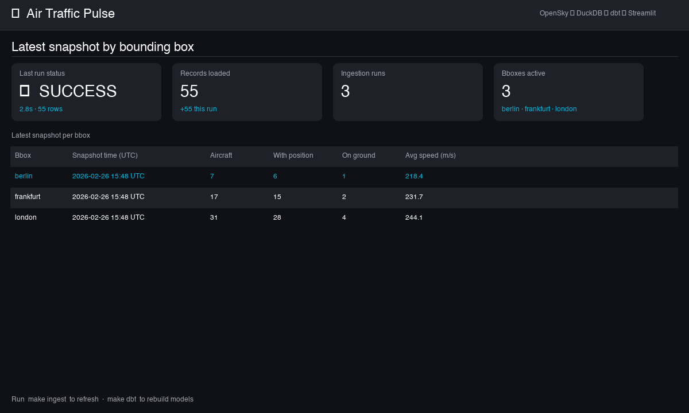
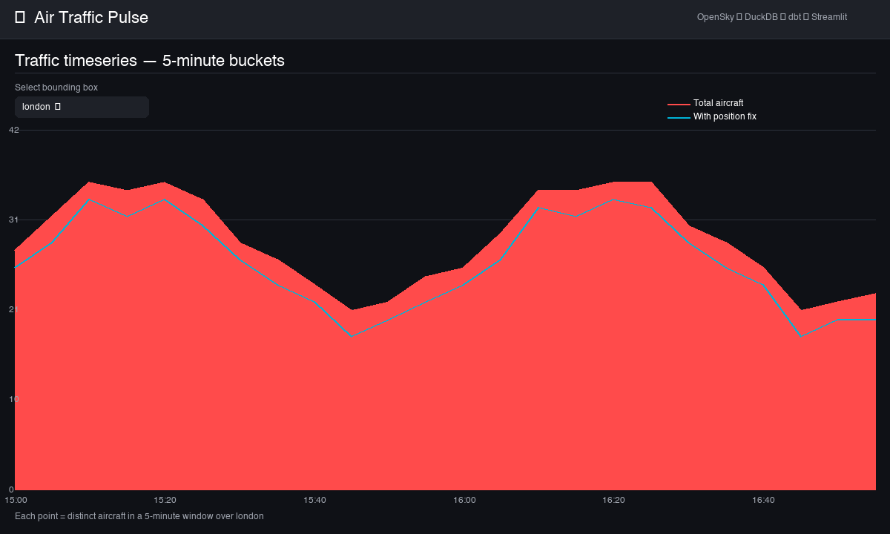

# Air Traffic Pulse

[](https://github.com/PZawieja/air-traffic-pulse/actions/workflows/ci.yml)
[](https://www.python.org/)
[](https://www.getdbt.com/)
[](https://duckdb.org/)
[](https://streamlit.io/)

A self-contained analytics-engineering portfolio project that tracks live
air-traffic data end-to-end — from raw API calls to an interactive dashboard —
entirely on your laptop with no cloud dependencies.

---

## What this repo demonstrates

| Skill | Implementation |
|---|---|
| **API ingestion** | Typed HTTP client with exponential back-off, 429/5xx retry, optional Basic Auth |
| **Raw → staging → marts modeling** | dbt-duckdb project with views → tables, full lineage |
| **Data quality** | 34 dbt tests: `not_null`, `unique`, `accepted_values`, `unique_combination` |
| **Local warehouse** | DuckDB with a typed schema, idempotent DDL, `executemany` bulk inserts |
| **Offline / demo mode** | Fixture-based ingestion path — no network required |
| **Streamlit product UI** | Metric cards, snapshot table, 5-min timeseries chart |
| **CI/CD** | GitHub Actions: lint → pytest → demo ingest → dbt build |

---

## Architecture

```
                    ┌──────────────────────────────────────────────────┐
                    │              Air Traffic Pulse                   │
                    │                                                  │
                    │  ┌─────────────┐   ┌────────────────────────┐   │
  OpenSky REST  ───►│  │ ingestion/  │──►│ raw.opensky_states     │   │
  (or fixtures) │   │  │ (Python)    │   │ raw.ingestion_runs     │   │
                    │  └─────────────┘   │ (DuckDB file)          │   │
                    │                    └───────────┬────────────┘   │
                    │                                │                 │
                    │                    ┌───────────▼────────────┐   │
                    │                    │ dbt/                   │   │
                    │                    │  stg_opensky_states    │   │
                    │                    │  stg_ingestion_runs    │   │
                    │                    │  mart_latest_snapshot  │   │
                    │                    │  mart_timeseries_5min  │   │
                    │                    │  mart_latest_run       │   │
                    │                    └───────────┬────────────┘   │
                    │                                │                 │
                    │                    ┌───────────▼────────────┐   │
                    │                    │ app/streamlit_app.py   │──►│ localhost:8501
                    │                    └────────────────────────┘   │
                    └──────────────────────────────────────────────────┘
```

---

## Screenshots

| Overview | Timeseries |
|:---:|:---:|
|  |  |

---

## Run modes

### Demo mode (offline — no network, no credentials)

Loads bundled fixture JSON files instead of polling the OpenSky API.
Deterministic, fast, and works in CI or air-gapped environments.

```bash
make demo       # fixture ingest → dbt build
make demo-app   # launch Streamlit against the demo database
```

### Live mode (real OpenSky data)

Polls the OpenSky Network REST API for live aircraft state vectors.
Anonymous access works but is rate-limited (~1 req/10s per bbox).
Add credentials to `.env` for a higher quota.

```bash
make ingest     # fetch live data → DuckDB
make dbt        # build staging + mart models
make app        # launch Streamlit dashboard
```

---

## Quickstart — Demo (recommended first try)

```bash
# 1. Clone and set up the isolated virtual environment
git clone https://github.com/PZawieja/air-traffic-pulse.git
cd air-traffic-pulse
make setup          # creates .venv, installs all deps (uv if available, else pip)

# 2. Run the offline demo pipeline
make demo           # loads fixture data → builds dbt models

# 3. Open the dashboard
make demo-app       # http://localhost:8501
```

---

## Quickstart — Live

### Option A: `uv` (preferred, faster installs)

```bash
curl -LsSf https://astral.sh/uv/install.sh | sh   # one-time

git clone https://github.com/PZawieja/air-traffic-pulse.git
cd air-traffic-pulse
make setup
cp .env.example .env
# Optional: add OPENSKY_USERNAME / OPENSKY_PASSWORD to .env
make ingest
make dbt
make app
```

### Option B: built-in `venv` + pip

```bash
git clone https://github.com/PZawieja/air-traffic-pulse.git
cd air-traffic-pulse
python3.11 -m venv .venv
source .venv/bin/activate
pip install -e ".[dev]"

cp .env.example .env
make ingest && make dbt && make app
```

> **Note on OpenSky rate limits**
> Anonymous access is limited to roughly one request per 10 seconds.
> [Register a free account](https://opensky-network.org) and add
> `OPENSKY_USERNAME` / `OPENSKY_PASSWORD` to `.env` for a higher quota.

---

## All commands

| Command | What it does |
|---|---|
| `make setup` | Create `.venv` + install all dependencies |
| `make ingest` | Fetch live aircraft states from OpenSky → DuckDB |
| `make dbt` | Run `dbt deps` + `dbt build` (staging + marts + tests) |
| `make app` | Launch the Streamlit dashboard |
| `make demo` | Offline: fixture ingest → dbt build (no network needed) |
| `make demo-app` | Launch dashboard against the demo database |
| `make test` | Run pytest (46 tests, offline) |
| `make fmt` | Auto-format + fix lints with ruff |
| `make lint` | Lint check without auto-fix |
| `make clean` | Remove `.venv` and all build artefacts |

---

## Project layout

```
.
├── src/air_traffic_pulse/   # Core package: config, logging, CLI entry-point
│   ├── config.py            # Pydantic Settings (bbox presets, demo mode, DB path)
│   ├── log.py               # Structured logger factory
│   └── cli.py               # python -m air_traffic_pulse {ingest|dbt|app}
│
├── ingestion/               # OpenSky HTTP client + orchestration
│   ├── opensky_client.py    # OpenSkyClient: retry/backoff, parse_states()
│   └── load_states.py       # Ingestion loop, run audit trail, demo mode branch
│
├── warehouse/               # DuckDB layer
│   ├── duckdb_conn.py       # get_connection(), init_schema()
│   └── schema.sql           # raw.opensky_states + raw.ingestion_runs DDL
│
├── dbt/                     # Analytics layer
│   ├── models/staging/      # stg_opensky_states, stg_ingestion_runs (views)
│   ├── models/marts/        # mart_latest_snapshot_by_bbox, timeseries, latest_run
│   └── profiles.yml         # DuckDB profile (respects DUCKDB_PATH env var)
│
├── app/
│   └── streamlit_app.py     # Dashboard: metrics, snapshot table, timeseries chart
│
├── tests/
│   ├── fixtures/            # Bundled OpenSky JSON for offline testing
│   ├── test_config.py       # Settings + bbox validation (12 tests)
│   ├── test_opensky_parse.py # parse_states() unit tests (25 tests)
│   ├── test_ingestion_smoke.py # Schema + insert roundtrip (9 tests)
│   └── test_demo_mode.py    # Demo-mode end-to-end tests (3 tests)
│
├── tools/
│   └── generate_placeholders.py  # Pillow script that generates docs/screenshots
│
└── .github/workflows/ci.yml # GitHub Actions: lint → test → demo ingest → dbt
```

---

## Configuration

All settings are read from `.env` (copy from `.env.example`):

| Variable | Default | Description |
|---|---|---|
| `OPENSKY_USERNAME` | _(empty)_ | OpenSky account username |
| `OPENSKY_PASSWORD` | _(empty)_ | OpenSky account password |
| `DUCKDB_PATH` | `./data/air_traffic_pulse.duckdb` | DuckDB file path |
| `OPENSKY_BBOX_PRESETS` | `berlin,frankfurt,london` | Comma-separated city presets |
| `AIR_TRAFFIC_PULSE_DEMO_MODE` | `0` | Set to `1` for offline fixture mode |

Built-in bounding-box presets: `berlin`, `frankfurt`, `london`.
Add custom presets in `src/air_traffic_pulse/config.py → BBOX_PRESETS`.

---

## Release checklist

Use this checklist before tagging a new version:

- [ ] All tests pass: `make test`
- [ ] Demo pipeline runs cleanly: `make demo && make demo-app`
- [ ] Lint is clean: `make lint`
- [ ] Bump the version number in `VERSION`
- [ ] Add a `## [x.y.z] — YYYY-MM-DD` section to `CHANGELOG.md`
- [ ] Commit and tag: `git tag vx.y.z && git push --tags`

---

## Troubleshooting

**HTTP 429 / rate-limit errors during ingestion**
OpenSky enforces strict rate limits for anonymous access. Either:
- Register a free account and add credentials to `.env`, or
- Use demo mode: `AIR_TRAFFIC_PULSE_DEMO_MODE=1 make ingest`

**Dashboard shows "Run `make dbt`" warning**
The mart tables haven't been built yet. Run `make dbt` (after `make ingest`).

**`dbt build` fails with "table not found"**
Ensure `make ingest` has been run at least once so raw tables exist.

**Wrong Python version picked up by `make`**
The Makefile resolves `python3.11` → `python3.12` → `python3.13` → `python3` in order.
Override with: `PYTHON3=/path/to/python3.11 make setup`

**Changing the bbox list**
Edit `OPENSKY_BBOX_PRESETS` in your `.env`.  To add a new city, also add its
bounding box to `BBOX_PRESETS` in `src/air_traffic_pulse/config.py`.
